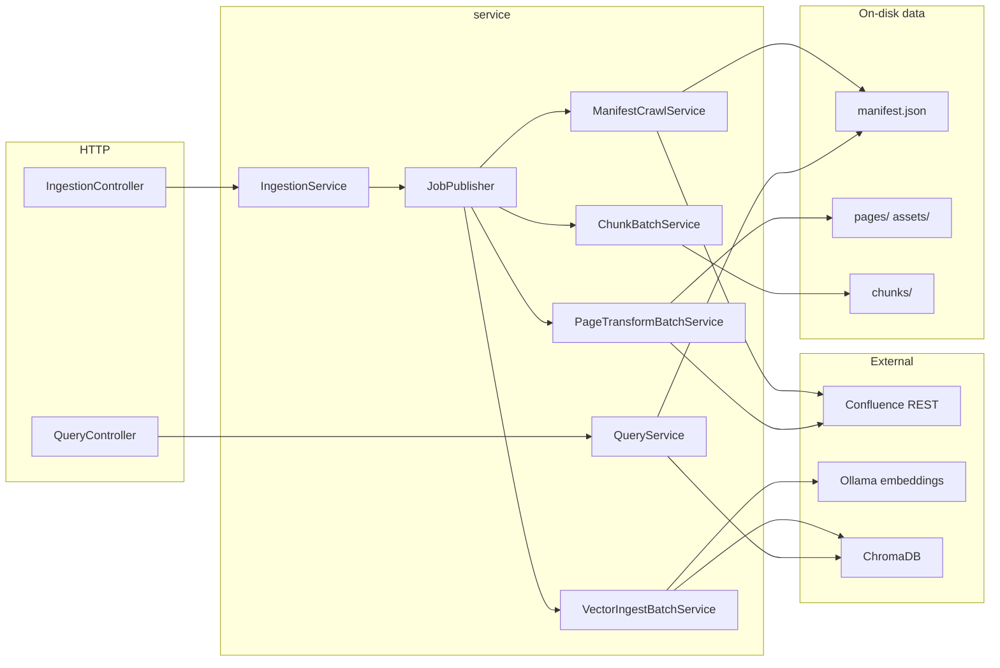

# Architecture

Parent index: [AGENTS.md](../../AGENTS.md)

## End-to-end flow



## Ingestion job chain

When `InProcessJobPublisher` is active (Kafka disabled):

1. **MANIFEST_CRAWL** → `ManifestCrawlService.runManifestCrawlAsync`
   - `PageCrawler` DFS walk → `ManifestService.rebuildManifestFromCrawl`
   - Writes `crawl-progress.json`
   - On success, may auto-start PAGE_TRANSFORM if `extractMarkdown` was in request

2. **PAGE_TRANSFORM** → `PageTransformBatchService.runPageTransformBatchAsync`
   - Pending pages: `!markdownExtracted && noOfRetries < threshold`
   - `PageTransformService` per page: fetch storage HTML → transform → assets
   - Writes `batch-progress.json` phase `PAGE_TRANSFORM`
   - On success, may chain CHUNK if `chunkMarkdown`

3. **CHUNK** → `ChunkBatchService.runChunkBatchAsync`
   - Pending: `markdownExtracted && !chunked`
   - `ChunkService` → `MarkdownChunker` → `ChunkStorageService`
   - Phase `CHUNK`; may chain VECTOR_INGEST

4. **VECTOR_INGEST** → `VectorIngestBatchService.runVectorIngestBatchAsync`
   - Pending: `chunked && !vectorIngested`
   - `VectorIngestService` → `ChromaIngestionService` + `EmbeddingService`
   - Phase `VECTOR_INGEST`; gated by `vector-ingest-enabled`

## Job mutual exclusion

`IngestionJobCoordinator` (in-memory): only one job type per `parentPageId` at a time.  
Returns `409 ALREADY_RUNNING` from `IngestionService` when acquire fails.

## On-disk layout

```
data/{parentPageId}/
├── manifest.json
├── crawl-progress.json
├── batch-progress.json
├── chunks/{pageId}.jsonl
└── pages/{pageId}/
    ├── page.md
    ├── metadata.json
    └── assets/
        ├── (images)
        ├── tables/*.json
        └── diagrams/
```

Optional per-page state (when `per-page-state-enabled=true`):  
`pages/{pageId}/ingestion-state.json` via `PageIngestionStateService`.

## Phase history

Phases 1–10: feature-complete monolith (see MIGRATION_PLAN.md).  
Phase 11: ports, OTel, concurrency options.  
Phase 12: Kafka adapters (disabled by default).  
Phase 13: staged module source trees (not Maven reactor yet).

## Key dependencies between packages

| From | To | Via |
|------|-----|-----|
| `api` | `service` | Controllers inject services |
| `service` | `confluence`, `transform`, `storage`, `rag`, `port`, `messaging` | Orchestration & batches |
| `storage` | `model`, `port` | ManifestRepository impl |
| `rag` | `model`, `port` | VectorStorePortAdapter |
| `confluence` | `port` | ConfluenceClient implements ConfluencePort |
| `messaging` | `service`, `port` | JobPublisher implementations |

**Rule:** Cross-boundary calls should go through `port` interfaces where they exist.

## Observability

Logging (`logs/app.log` with `traceId`/`spanId`), Micrometer + OTLP tracing, Swagger UI, and a step-by-step debug guide: [observability.md](observability.md).
